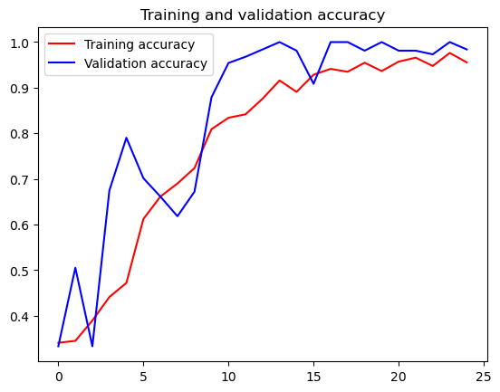

# xmsj5.2
```python
import os
rock_dir = os.path.join('F:/mldownload/rps/rock')
paper_dir = os.path.join('F:/mldownload/rps/paper')
scissors_dir = os.path.join('F:/mldownload/rps/scissors')

print('total training rock images:', len(os.listdir(rock_dir)))
print('total training paper images:', len(os.listdir(paper_dir)))
print('total training scissors images:', len(os.listdir(scissors_dir)))

rock_files = os.listdir(rock_dir)
print(rock_files[:10])

paper_files = os.listdir(paper_dir)
print(paper_files[:10])

scissors_files = os.listdir(scissors_dir)
print(scissors_files[:10])

```

    total training rock images: 840
    total training paper images: 840
    total training scissors images: 840
    ['rock01-000.png', 'rock01-001.png', 'rock01-002.png', 'rock01-003.png', 'rock01-004.png', 'rock01-005.png', 'rock01-006.png', 'rock01-007.png', 'rock01-008.png', 'rock01-009.png']
    ['paper01-000.png', 'paper01-001.png', 'paper01-002.png', 'paper01-003.png', 'paper01-004.png', 'paper01-005.png', 'paper01-006.png', 'paper01-007.png', 'paper01-008.png', 'paper01-009.png']
    ['scissors01-000.png', 'scissors01-001.png', 'scissors01-002.png', 'scissors01-003.png', 'scissors01-004.png', 'scissors01-005.png', 'scissors01-006.png', 'scissors01-007.png', 'scissors01-008.png', 'scissors01-009.png']


```python
%matplotlib inline

import matplotlib.pyplot as plt
import matplotlib.image as mpimg

pic_index = 2

next_rock = [os.path.join(rock_dir, fname) 
                for fname in rock_files[pic_index-2:pic_index]]
next_paper = [os.path.join(paper_dir, fname) 
                for fname in paper_files[pic_index-2:pic_index]]
next_scissors = [os.path.join(scissors_dir, fname) 
                for fname in scissors_files[pic_index-2:pic_index]]

for i, img_path in enumerate(next_rock+next_paper+next_scissors):
  #print(img_path)
  img = mpimg.imread(img_path)
  plt.imshow(img)
  plt.axis('Off')
  plt.show()

```


​    

​    


    


    


    


    


    


```python
import tensorflow as tf
import keras_preprocessing
from keras_preprocessing import image
from keras_preprocessing.image import ImageDataGenerator

TRAINING_DIR = "F:/mldownload/rps/"
training_datagen = ImageDataGenerator(
      rescale = 1./255,
	    rotation_range=40,
      width_shift_range=0.2,
      height_shift_range=0.2,
      shear_range=0.2,
      zoom_range=0.2,
      horizontal_flip=True,
      fill_mode='nearest')

VALIDATION_DIR = "F:/mldownload/rps-test-set/"
validation_datagen = ImageDataGenerator(rescale = 1./255)

train_generator = training_datagen.flow_from_directory(
	TRAINING_DIR,
	target_size=(150,150),
	class_mode='categorical',
  batch_size=126
)

validation_generator = validation_datagen.flow_from_directory(
	VALIDATION_DIR,
	target_size=(150,150),
	class_mode='categorical',
  batch_size=126
)

model = tf.keras.models.Sequential([
    # Note the input shape is the desired size of the image 150x150 with 3 bytes color
    # This is the first convolution
    tf.keras.layers.Conv2D(64, (3,3), activation='relu', input_shape=(150, 150, 3)),
    tf.keras.layers.MaxPooling2D(2, 2),
    # The second convolution
    tf.keras.layers.Conv2D(64, (3,3), activation='relu'),
    tf.keras.layers.MaxPooling2D(2,2),
    # The third convolution
    tf.keras.layers.Conv2D(128, (3,3), activation='relu'),
    tf.keras.layers.MaxPooling2D(2,2),
    # The fourth convolution
    tf.keras.layers.Conv2D(128, (3,3), activation='relu'),
    tf.keras.layers.MaxPooling2D(2,2),
    # Flatten the results to feed into a DNN
    tf.keras.layers.Flatten(),
    tf.keras.layers.Dropout(0.5),
    # 512 neuron hidden layer
    tf.keras.layers.Dense(512, activation='relu'),
    tf.keras.layers.Dense(3, activation='softmax')
])


model.summary()

model.compile(loss = 'categorical_crossentropy', optimizer='rmsprop', metrics=['accuracy'])

history = model.fit(train_generator, epochs=25, steps_per_epoch=20, validation_data = validation_generator, verbose = 1, validation_steps=3)

model.save("rps.h5")

```

    Found 2520 images belonging to 3 classes.
    Found 372 images belonging to 3 classes.


<pre style="white-space:pre;overflow-x:auto;line-height:normal;font-family:Menlo,'DejaVu Sans Mono',consolas,'Courier New',monospace"><span style="font-weight: bold">Model: "sequential"</span>
</pre>


<pre style="white-space:pre;overflow-x:auto;line-height:normal;font-family:Menlo,'DejaVu Sans Mono',consolas,'Courier New',monospace">┏━━━━━━━━━━━━━━━━━━━━━━━━━━━━━━━━━┳━━━━━━━━━━━━━━━━━━━━━━━━┳━━━━━━━━━━━━━━━┓
┃<span style="font-weight: bold"> Layer (type)                    </span>┃<span style="font-weight: bold"> Output Shape           </span>┃<span style="font-weight: bold">       Param # </span>┃
┡━━━━━━━━━━━━━━━━━━━━━━━━━━━━━━━━━╇━━━━━━━━━━━━━━━━━━━━━━━━╇━━━━━━━━━━━━━━━┩
│ conv2d (<span style="color: #0087ff; text-decoration-color: #0087ff">Conv2D</span>)                 │ (<span style="color: #00d7ff; text-decoration-color: #00d7ff">None</span>, <span style="color: #00af00; text-decoration-color: #00af00">148</span>, <span style="color: #00af00; text-decoration-color: #00af00">148</span>, <span style="color: #00af00; text-decoration-color: #00af00">64</span>)   │         <span style="color: #00af00; text-decoration-color: #00af00">1,792</span> │
├─────────────────────────────────┼────────────────────────┼───────────────┤
│ max_pooling2d (<span style="color: #0087ff; text-decoration-color: #0087ff">MaxPooling2D</span>)    │ (<span style="color: #00d7ff; text-decoration-color: #00d7ff">None</span>, <span style="color: #00af00; text-decoration-color: #00af00">74</span>, <span style="color: #00af00; text-decoration-color: #00af00">74</span>, <span style="color: #00af00; text-decoration-color: #00af00">64</span>)     │             <span style="color: #00af00; text-decoration-color: #00af00">0</span> │
├─────────────────────────────────┼────────────────────────┼───────────────┤
│ conv2d_1 (<span style="color: #0087ff; text-decoration-color: #0087ff">Conv2D</span>)               │ (<span style="color: #00d7ff; text-decoration-color: #00d7ff">None</span>, <span style="color: #00af00; text-decoration-color: #00af00">72</span>, <span style="color: #00af00; text-decoration-color: #00af00">72</span>, <span style="color: #00af00; text-decoration-color: #00af00">64</span>)     │        <span style="color: #00af00; text-decoration-color: #00af00">36,928</span> │
├─────────────────────────────────┼────────────────────────┼───────────────┤
│ max_pooling2d_1 (<span style="color: #0087ff; text-decoration-color: #0087ff">MaxPooling2D</span>)  │ (<span style="color: #00d7ff; text-decoration-color: #00d7ff">None</span>, <span style="color: #00af00; text-decoration-color: #00af00">36</span>, <span style="color: #00af00; text-decoration-color: #00af00">36</span>, <span style="color: #00af00; text-decoration-color: #00af00">64</span>)     │             <span style="color: #00af00; text-decoration-color: #00af00">0</span> │
├─────────────────────────────────┼────────────────────────┼───────────────┤
│ conv2d_2 (<span style="color: #0087ff; text-decoration-color: #0087ff">Conv2D</span>)               │ (<span style="color: #00d7ff; text-decoration-color: #00d7ff">None</span>, <span style="color: #00af00; text-decoration-color: #00af00">34</span>, <span style="color: #00af00; text-decoration-color: #00af00">34</span>, <span style="color: #00af00; text-decoration-color: #00af00">128</span>)    │        <span style="color: #00af00; text-decoration-color: #00af00">73,856</span> │
├─────────────────────────────────┼────────────────────────┼───────────────┤
│ max_pooling2d_2 (<span style="color: #0087ff; text-decoration-color: #0087ff">MaxPooling2D</span>)  │ (<span style="color: #00d7ff; text-decoration-color: #00d7ff">None</span>, <span style="color: #00af00; text-decoration-color: #00af00">17</span>, <span style="color: #00af00; text-decoration-color: #00af00">17</span>, <span style="color: #00af00; text-decoration-color: #00af00">128</span>)    │             <span style="color: #00af00; text-decoration-color: #00af00">0</span> │
├─────────────────────────────────┼────────────────────────┼───────────────┤
│ conv2d_3 (<span style="color: #0087ff; text-decoration-color: #0087ff">Conv2D</span>)               │ (<span style="color: #00d7ff; text-decoration-color: #00d7ff">None</span>, <span style="color: #00af00; text-decoration-color: #00af00">15</span>, <span style="color: #00af00; text-decoration-color: #00af00">15</span>, <span style="color: #00af00; text-decoration-color: #00af00">128</span>)    │       <span style="color: #00af00; text-decoration-color: #00af00">147,584</span> │
├─────────────────────────────────┼────────────────────────┼───────────────┤
│ max_pooling2d_3 (<span style="color: #0087ff; text-decoration-color: #0087ff">MaxPooling2D</span>)  │ (<span style="color: #00d7ff; text-decoration-color: #00d7ff">None</span>, <span style="color: #00af00; text-decoration-color: #00af00">7</span>, <span style="color: #00af00; text-decoration-color: #00af00">7</span>, <span style="color: #00af00; text-decoration-color: #00af00">128</span>)      │             <span style="color: #00af00; text-decoration-color: #00af00">0</span> │
├─────────────────────────────────┼────────────────────────┼───────────────┤
│ flatten (<span style="color: #0087ff; text-decoration-color: #0087ff">Flatten</span>)               │ (<span style="color: #00d7ff; text-decoration-color: #00d7ff">None</span>, <span style="color: #00af00; text-decoration-color: #00af00">6272</span>)           │             <span style="color: #00af00; text-decoration-color: #00af00">0</span> │
├─────────────────────────────────┼────────────────────────┼───────────────┤
│ dropout (<span style="color: #0087ff; text-decoration-color: #0087ff">Dropout</span>)               │ (<span style="color: #00d7ff; text-decoration-color: #00d7ff">None</span>, <span style="color: #00af00; text-decoration-color: #00af00">6272</span>)           │             <span style="color: #00af00; text-decoration-color: #00af00">0</span> │
├─────────────────────────────────┼────────────────────────┼───────────────┤
│ dense (<span style="color: #0087ff; text-decoration-color: #0087ff">Dense</span>)                   │ (<span style="color: #00d7ff; text-decoration-color: #00d7ff">None</span>, <span style="color: #00af00; text-decoration-color: #00af00">512</span>)            │     <span style="color: #00af00; text-decoration-color: #00af00">3,211,776</span> │
├─────────────────────────────────┼────────────────────────┼───────────────┤
│ dense_1 (<span style="color: #0087ff; text-decoration-color: #0087ff">Dense</span>)                 │ (<span style="color: #00d7ff; text-decoration-color: #00d7ff">None</span>, <span style="color: #00af00; text-decoration-color: #00af00">3</span>)              │         <span style="color: #00af00; text-decoration-color: #00af00">1,539</span> │
└─────────────────────────────────┴────────────────────────┴───────────────┘
</pre>


<pre style="white-space:pre;overflow-x:auto;line-height:normal;font-family:Menlo,'DejaVu Sans Mono',consolas,'Courier New',monospace"><span style="font-weight: bold"> Total params: </span><span style="color: #00af00; text-decoration-color: #00af00">3,473,475</span> (13.25 MB)
</pre>


<pre style="white-space:pre;overflow-x:auto;line-height:normal;font-family:Menlo,'DejaVu Sans Mono',consolas,'Courier New',monospace"><span style="font-weight: bold"> Trainable params: </span><span style="color: #00af00; text-decoration-color: #00af00">3,473,475</span> (13.25 MB)
</pre>


<pre style="white-space:pre;overflow-x:auto;line-height:normal;font-family:Menlo,'DejaVu Sans Mono',consolas,'Courier New',monospace"><span style="font-weight: bold"> Non-trainable params: </span><span style="color: #00af00; text-decoration-color: #00af00">0</span> (0.00 B)
</pre>


    Epoch 1/25
    20/20 ━━━━━━━━━━━━━━━━━━━━ 121s 6s/step - accuracy: 0.3416 - loss: 1.8288 - val_accuracy: 0.3333 - val_loss: 1.0971
    Epoch 2/25
    20/20 ━━━━━━━━━━━━━━━━━━━━ 83s 4s/step - accuracy: 0.3356 - loss: 1.0977 - val_accuracy: 0.5054 - val_loss: 1.0961
    Epoch 3/25
    20/20 ━━━━━━━━━━━━━━━━━━━━ 82s 4s/step - accuracy: 0.3790 - loss: 1.0970 - val_accuracy: 0.3333 - val_loss: 1.0941
    Epoch 4/25
    20/20 ━━━━━━━━━━━━━━━━━━━━ 82s 4s/step - accuracy: 0.4151 - loss: 1.0805 - val_accuracy: 0.6747 - val_loss: 0.6196
    Epoch 5/25
    20/20 ━━━━━━━━━━━━━━━━━━━━ 82s 4s/step - accuracy: 0.4591 - loss: 1.0912 - val_accuracy: 0.7903 - val_loss: 0.8598
    Epoch 6/25
    20/20 ━━━━━━━━━━━━━━━━━━━━ 82s 4s/step - accuracy: 0.6089 - loss: 0.8525 - val_accuracy: 0.7016 - val_loss: 0.7339
    Epoch 7/25
    20/20 ━━━━━━━━━━━━━━━━━━━━ 82s 4s/step - accuracy: 0.6546 - loss: 0.7656 - val_accuracy: 0.6613 - val_loss: 0.4476
    Epoch 8/25
    20/20 ━━━━━━━━━━━━━━━━━━━━ 82s 4s/step - accuracy: 0.6737 - loss: 0.6859 - val_accuracy: 0.6183 - val_loss: 0.5531
    Epoch 9/25
    20/20 ━━━━━━━━━━━━━━━━━━━━ 82s 4s/step - accuracy: 0.6969 - loss: 0.6773 - val_accuracy: 0.6720 - val_loss: 0.4744
    Epoch 10/25
    20/20 ━━━━━━━━━━━━━━━━━━━━ 83s 4s/step - accuracy: 0.8024 - loss: 0.4810 - val_accuracy: 0.8790 - val_loss: 0.2055
    Epoch 11/25
    20/20 ━━━━━━━━━━━━━━━━━━━━ 82s 4s/step - accuracy: 0.8474 - loss: 0.3972 - val_accuracy: 0.9543 - val_loss: 0.1269
    Epoch 12/25
    20/20 ━━━━━━━━━━━━━━━━━━━━ 82s 4s/step - accuracy: 0.8743 - loss: 0.3436 - val_accuracy: 0.9677 - val_loss: 0.1521
    Epoch 13/25
    20/20 ━━━━━━━━━━━━━━━━━━━━ 82s 4s/step - accuracy: 0.9023 - loss: 0.2770 - val_accuracy: 0.9839 - val_loss: 0.0529
    Epoch 14/25
    20/20 ━━━━━━━━━━━━━━━━━━━━ 82s 4s/step - accuracy: 0.9170 - loss: 0.2096 - val_accuracy: 1.0000 - val_loss: 0.0268
    Epoch 15/25
    20/20 ━━━━━━━━━━━━━━━━━━━━ 82s 4s/step - accuracy: 0.8849 - loss: 0.3000 - val_accuracy: 0.9812 - val_loss: 0.0601
    Epoch 16/25
    20/20 ━━━━━━━━━━━━━━━━━━━━ 82s 4s/step - accuracy: 0.9326 - loss: 0.1927 - val_accuracy: 0.9086 - val_loss: 0.1811
    Epoch 17/25
    20/20 ━━━━━━━━━━━━━━━━━━━━ 82s 4s/step - accuracy: 0.9338 - loss: 0.1923 - val_accuracy: 1.0000 - val_loss: 0.0221
    Epoch 18/25
    20/20 ━━━━━━━━━━━━━━━━━━━━ 82s 4s/step - accuracy: 0.9169 - loss: 0.1971 - val_accuracy: 1.0000 - val_loss: 0.0126
    Epoch 19/25
    20/20 ━━━━━━━━━━━━━━━━━━━━ 82s 4s/step - accuracy: 0.9538 - loss: 0.1446 - val_accuracy: 0.9812 - val_loss: 0.0383
    Epoch 20/25
    20/20 ━━━━━━━━━━━━━━━━━━━━ 83s 4s/step - accuracy: 0.8981 - loss: 0.3083 - val_accuracy: 1.0000 - val_loss: 0.0251
    Epoch 21/25
    20/20 ━━━━━━━━━━━━━━━━━━━━ 82s 4s/step - accuracy: 0.9556 - loss: 0.1393 - val_accuracy: 0.9812 - val_loss: 0.0616
    Epoch 22/25
    20/20 ━━━━━━━━━━━━━━━━━━━━ 82s 4s/step - accuracy: 0.9698 - loss: 0.0949 - val_accuracy: 0.9812 - val_loss: 0.0377
    Epoch 23/25
    20/20 ━━━━━━━━━━━━━━━━━━━━ 82s 4s/step - accuracy: 0.9405 - loss: 0.1548 - val_accuracy: 0.9731 - val_loss: 0.0463
    Epoch 24/25
    20/20 ━━━━━━━━━━━━━━━━━━━━ 158s 8s/step - accuracy: 0.9782 - loss: 0.0653 - val_accuracy: 1.0000 - val_loss: 0.0122
    Epoch 25/25
    20/20 ━━━━━━━━━━━━━━━━━━━━ 82s 4s/step - accuracy: 0.9484 - loss: 0.1382 - val_accuracy: 0.9839 - val_loss: 0.0322

```python
import matplotlib.pyplot as plt
acc = history.history['accuracy']
val_acc = history.history['val_accuracy']
loss = history.history['loss']
val_loss = history.history['val_loss']

epochs = range(len(acc))

plt.plot(epochs, acc, 'r', label='Training accuracy')
plt.plot(epochs, val_acc, 'b', label='Validation accuracy')
plt.title('Training and validation accuracy')
plt.legend(loc=0)
plt.figure()
plt.show()

```


​    

​    


    <Figure size 640x480 with 0 Axes>


```python

```
